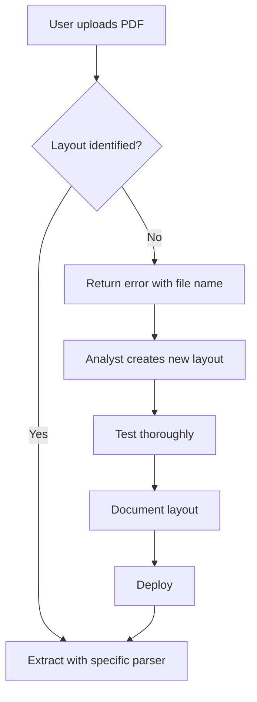

# Parsing Guidelines - Auditor Contábil

## Core Philosophy: Layout-Specific Parsing Only

> **CRITICAL POLICY**: This system does NOT use generic parsing. Every bank statement layout MUST have its own dedicated, tested extraction logic.

## Fundamental Rules

### 1. No Generic Fallbacks
- ❌ **NEVER** rely on generic parsing as the primary extraction method
- ❌ **NEVER** assume a layout will work for multiple banks
- ✅ **ALWAYS** create a specific parser for each identified layout
- ✅ **ALWAYS** test thoroughly before deploying

### 2. Layout Identification
Every PDF must be identified to a specific layout before extraction:

```python
# ✅ CORRECT: Specific layout detection
if "G331" in text and bank_id == "001":
    return self._extract_bb_g331(page)
elif self._has_full_format(text) and bank_id == "001":
    return self._extract_bb_full_format(page)

# ❌ WRONG: Generic fallback as primary method
return self.extract_transactions_smart(page)  # Only use when layout creation is needed
```

### 3. Unknown Layout Handling

When a layout is not identified:

1. **Stop processing immediately**
2. **Log detailed information**: bank name, file name, sample text
3. **Return clear error to user**: "Layout não identificado para arquivo X"
4. **Create new layout** before allowing upload to proceed

## Implementation Requirements

### Parser Structure

Each bank must have:

```
src/parsing/banks/
├── bb.py              # Banco do Brasil - Multiple layout methods
├── itau.py            # Itaú - Layout-specific methods
├── santander.py       # Santander - Layout-specific methods
└── ...
```

Each parser file must contain:

1. **Layout detection methods**: Check for unique markers
2. **Specific extraction methods**: One per layout variant
3. **Validation logic**: Ensure extracted data is correct
4. **Clear error messages**: What went wrong and which file

### Layout Detection Example

```python
def extract_page(self, page):
    text = page.extract_text() or ""
    
    # Try layouts in order of specificity
    if "G331" in text:
        return self._extract_g331(page)
    elif self._has_full_format(text):
        return self._extract_full_format(page)
    elif self._has_simplified_format(text):
        return self._extract_simplified_format(page)
    else:
        # Unknown layout - STOP and alert
        raise LayoutNotIdentifiedException(
            f"Unable to identify BB layout. File markers: {self._get_layout_markers(text)}"
        )
```

### Error Reporting

The pipeline must report:
- **File name** where layout was not identified
- **Bank detected** (if any)
- **Sample text** from the PDF (first 500 chars)
- **Suggested action**: "Create new layout definition"

## Adding New Layouts

When a new layout is encountered:

### Step 1: Analyze the PDF
```bash
# Extract sample pages
python scripts/analyze_pdf_layout.py path/to/statement.pdf
```

### Step 2: Create Layout Detection
- Identify unique markers (headers, formats, keywords)
- Add detection method to appropriate bank parser
- Ensure it doesn't conflict with existing layouts

### Step 3: Create Extraction Logic
- Define regex patterns for transaction lines
- Handle multi-line descriptions
- Parse dates, amounts, and descriptions correctly
- Handle Brazilian number formats (1.234,56)

### Step 4: Validate
- Test with multiple PDFs of the same layout
- Verify transaction count matches manual count
- Check balance reconciliation if available
- Ensure no false positives

### Step 5: Document
- Add layout description to parser docstring
- Document unique markers
- Provide sample transaction line format

## Common Patterns by Bank

### Banco do Brasil
- **G331 Layout**: Has "G331" marker, uses AGÊNCIA/LOTE/DOCUMENTO format
- **Full Format**: `DD/MM/YYYY AAAA LLLLLLLL DESCRIPTION VALOR C/D`
- **Simplified Format**: Date on separate line, details on next line(s)

### Itaú
- **Format varies** by account type (PJ vs PF)
- Always check for account type markers

### Santander
- **Multiple date formats**: DD/MM/YYYY and DD/MM/YY
- Requires date normalization

## Testing Requirements

Before merging new layout code:

1. ✅ Extract 100% of transactions from sample PDF
2. ✅ Verify no false positives (non-transactions extracted)
3. ✅ Balance check passes (if PDF includes balances)
4. ✅ Date parsing is accurate
5. ✅ Amount signs are correct (debits negative, credits positive)
6. ✅ Descriptions are complete (multi-line handled correctly)

## Workflow for Unknown Layouts



## Anti-Patterns to Avoid

### ❌ DON'T: Use generic regex for all banks
```python
# This will fail for edge cases
pattern = r'(\d{2}/\d{2}/\d{4})\s+(.*?)\s+([\d\.,]+)'
```

### ❌ DON'T: Silently skip unidentified layouts
```python
if not rows:
    return []  # User won't know extraction failed
```

### ❌ DON'T: Mix layouts in one method
```python
# Confusing and error-prone
def extract_all_bb_formats(self, page):
    # Tries to handle G331, full, and simplified in one method
```

### ✅ DO: Have clear, separate methods
```python
def extract_page(self, page):
    if self._is_g331(page):
        return self._extract_g331(page)
    elif self._is_full_format(page):
        return self._extract_full_format(page)
    # ... etc
```

### ✅ DO: Validate and fail fast
```python
if not self._can_extract(page):
    raise LayoutNotIdentifiedException(
        f"Cannot extract from this BB layout. File: {filename}"
    )
```

## Monitoring and Maintenance

### Track Layout Success Rates
- Log which layouts are used most frequently
- Monitor extraction failure rates per layout
- Alert when new patterns emerge

### Version Control for Layouts
- When updating a layout parser, create a new version
- Keep old version for backward compatibility if needed
- Document why changes were made

### User Feedback Loop
- When users report missing transactions, investigate layout
- Create test cases from user-reported issues
- Improve layout detection and extraction

## Parsing de Diários Contábeis (CSV)

Diferente dos extratos bancários PDF, os diários contábeis em CSV seguem um padrão de extração de metadados específico para identificar a empresa.

### Extração de Empresa e Código
O sistema tenta extrair o nome e o código da empresa das primeiras linhas do arquivo CSV:
- **Linha 2**: Espera-se o formato `"Consulta de lançamentos da empresa [CÓDIGO] - [NOME DA EMPRESA]"`.
- **Processamento**: O sistema separa o código e o nome, armazenando-os no estado global para uso em cabeçalhos de relatórios.

### Configuração de Colunas Ledger
O parsing do diário (`src/utils/csv_helper.py`) utiliza delimitadores `;` e codificação `latin1` por padrão para compatibilidade com sistemas contábeis brasileiros legados.

---

## Resumo das Exportações

As exportações (Excel/PDF) são geradas a partir de dados passados via POST, garantindo que:
1. O cabeçalho dos relatórios inclua o nome da empresa extraído durante o upload.
2. O conteúdo reflita exatamente os filtros aplicados pelo usuário.

---

**The golden rule**: If you can't identify the exact layout with confidence, don't extract. Return a clear error and create the layout first.

This ensures:
- High accuracy (no guessing)
- Clear user feedback (they know what's wrong)
- Maintainable code (each layout is isolated)
- Audit trail (know which layout was used for which file)
